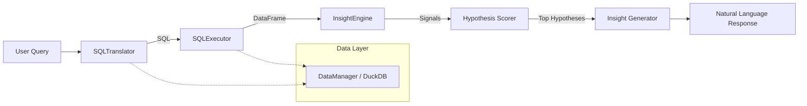

# InsightX - Conversational Analytics Engine

> A production-grade conversational AI system that translates natural language queries into data-backed business insights for digital payment transaction data.


---

## Architecture

```
User Query → NL Understanding → SQL Generation → Query Execution →
Signal Extraction → Hypothesis Scoring → Insight Generation → Natural Language Response
```

### System Diagram



### Module Overview

| Module | Class | Responsibility |
|--------|-------|----------------|
| `data_manager.py` | `DataManager` | DuckDB initialization, schema management, query validation |
| `translator.py` | `SQLTranslator` | NL → SQL conversion via Llama 3.1 70B |
| `executor.py` | `SQLExecutor` | SQL execution, result caching, performance tracking |
| `analytics.py` | `InsightEngine` | Signal extraction, hypothesis scoring, insight generation |
| `main.py` | `InsightXEngine` | Pipeline orchestration (zero business logic) |
| `frontend.py` | — | Streamlit UI with Apple-inspired design |

---

## Quick Start

### 1. Prerequisites

- Python 3.10+
- [Groq API Key](https://console.groq.com/) (free tier available)

### 2. Installation

```bash
# Clone the repository
git clone <repo-url>
cd shinchan.ai

# Create virtual environment
python -m venv venv
source venv/bin/activate  # macOS/Linux
# venv\Scripts\activate   # Windows

# Install dependencies
pip install -r requirements.txt
```

### 3. Set API Key

```bash
export GROQ_API_KEY="your-groq-api-key-here"
```

### 4. Generate Dataset (if you don't have one)

```bash
python generate_dataset.py
```

This creates `250k_transactions.csv` with 250,000 realistic synthetic transactions.

### 5. Run the Application

**Streamlit UI (recommended):**
```bash
streamlit run frontend.py
```

**CLI mode:**
```bash
python main.py
```

---

## Dataset Schema

| Column | Type | Description |
|--------|------|-------------|
| `transaction_id` | VARCHAR | Unique identifier |
| `timestamp` | TIMESTAMP | Transaction datetime |
| `transaction_type` | VARCHAR | P2P, P2M, Bill Payment, Recharge |
| `merchant_category` | VARCHAR | NULL for P2P (structural) |
| `amount_inr` | DECIMAL | Amount in INR |
| `transaction_status` | VARCHAR | SUCCESS or FAILED |
| `sender_age_group` | VARCHAR | 18-25, 26-35, 36-45, 46-55, 56+ |
| `receiver_age_group` | VARCHAR | NULL for non-P2P (structural) |
| `sender_state` | VARCHAR | Indian state |
| `sender_bank` | VARCHAR | Bank name |
| `receiver_bank` | VARCHAR | Bank name |
| `device_type` | VARCHAR | Android, iOS, Web |
| `network_type` | VARCHAR | 3G, 4G, 5G, WiFi |
| `fraud_flag` | INTEGER | 0 = Not flagged; 1 = Flagged for review (NOT confirmed fraud) |
| `hour_of_day` | INTEGER | 0-23 |
| `day_of_week` | VARCHAR | Monday-Sunday |
| `is_weekend` | INTEGER | 0 or 1 |

### Important Data Notes

- **`fraud_flag = 1`** means "flagged for manual review", **NOT confirmed fraud**
- **`merchant_category` is NULL** for all P2P transactions (intentional)
- **`receiver_age_group` is NULL** for all non-P2P transactions (intentional)

---

## Sample Queries

### Descriptive
- "What is the average transaction amount for bill payments?"
- "How many P2P transfers were made on weekends?"
- "What's the overall success rate?"

### Comparative
- "How do failure rates compare between Android and iOS users?"
- "Which age group uses P2P most frequently?"
- "Compare transaction volumes between SBI and HDFC"

### Temporal
- "What are the peak transaction hours for food delivery?"
- "Show me weekend vs weekday failure rates"
- "When do bill payment failures spike?"

### Correlation
- "Is there a relationship between network type and transaction success?"
- "Do 3G users have higher failure rates than WiFi users?"
- "Which merchant categories fail most on mobile networks?"

### Risk Analysis
- "What percentage of high-value transactions are flagged for review?"
- "Which banks have the highest fraud flag rates?"
- "Are there patterns in flagged transactions by age group?"

### Complex Multi-Dimensional
- "Which sender banks have the highest failure rates for bill payments over ₹1,000 during weekends?"
- "Compare P2P transaction patterns between 18-25 and 56+ age groups on iOS vs Android"

---

## Hypothesis Library

The system uses a pre-defined hypothesis library (`hypotheses.json`) to explain observed data patterns:

| ID | Hypothesis | Key Signals |
|----|-----------|------------|
| H1 | Third-party system dependency | EXTERNAL_DEPENDENCY, HIGH_FAILURE_RATE |
| H2 | Validation & input complexity | HEAVY_VALIDATION, HIGH_RETRIES |
| H3 | Peak-hour load sensitivity | PEAK_SENSITIVE |
| H4 | Scheduled maintenance windows | MAINTENANCE_WINDOW_PATTERN |
| H5 | Network connectivity issues | NETWORK_FRAGILITY |
| H6 | Device-platform specific failures | DEVICE_SENSITIVITY |
| H7 | High-value transaction risk | HIGH_VALUE_RISK |
| H8 | Bank-specific processing issues | BANK_CONCENTRATION |

**Scoring Formula:**
```
score = 0.7 × (required_signals_matched / total_required) + 
        0.3 × (supporting_signals_matched / total_supporting)
```

---

## Design Principles

1. **Deterministic Data Layer**: All numerical computations in SQL/DuckDB, never by LLMs
2. **Hypothesis-Driven Analysis**: Matches patterns to pre-defined scenarios only
3. **Separation of Concerns**: Clear module boundaries with defined contracts
4. **Speed-First**: <500ms target for most queries
5. **Explainability-First**: Every insight traceable to data evidence

---

## Project Structure

```
/project_root
├── main.py                    # Orchestrator (zero business logic)
├── frontend.py               # Streamlit UI
├── data_manager.py           # DuckDB management
├── translator.py             # NL → SQL (Groq/Llama 3.1)
├── executor.py               # SQL execution engine
├── analytics.py              # Signal extraction & hypothesis scoring
├── hypotheses.json           # Business hypothesis library
├── generate_dataset.py       # Synthetic data generator
├── requirements.txt          # Dependencies
├── 250k_transactions.csv     # Dataset (generated)
└── README.md                 # This file
```

---

## Tech Stack

- **Database**: DuckDB (in-memory SQL engine)
- **LLM**: Llama 3.1 70B via Groq API
- **Frontend**: Streamlit
- **Data**: Pandas + NumPy
- **Logging**: Loguru

---

## License

MIT
