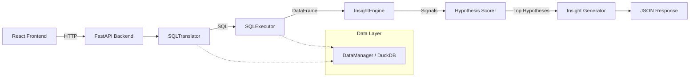

# Shinchan AI - Conversational Analytics Engine

> A conversational AI system that translates natural language queries into data-backed business insights for digital payment transaction data. Built with React + FastAPI.


---

## Architecture

```
User Query → NL Understanding → SQL Generation → Query Execution →
Signal Extraction → Hypothesis Scoring → Insight Generation → Natural Language Response
```

### System Diagram



---

## Quick Start

### 1. Prerequisites

- Python 3.10+
- Node.js 18+
- [Groq API Key](https://console.groq.com/) (free tier available)

### 2. Backend Setup

```bash
cd shinchan.ai.v2/backend

# Create virtual environment
python -m venv venv
source venv/bin/activate  # macOS/Linux
# venv\Scripts\activate   # Windows

# Install dependencies
pip install -r requirements.txt

# Set up environment variables
cp .env.example .env
# Edit .env and add your GROQ_API_KEY
```

### 3. Frontend Setup

```bash
cd shinchan.ai.v2/frontend

# Install dependencies
npm install
```

### 4. Generate Dataset (if needed)

```bash
# From the project root
python generate_dataset.py
```

This creates `250k_transactions.csv` with 250,000 realistic synthetic transactions.

### 5. Run the Application

**Start the backend (Terminal 1):**
```bash
cd shinchan.ai.v2/backend
python run.py
```
Backend runs at `http://localhost:8000` — API docs at `http://localhost:8000/docs`

**Start the frontend (Terminal 2):**
```bash
cd shinchan.ai.v2/frontend
npm run dev
```
Frontend runs at `http://localhost:5173` — API calls are proxied to the backend.

---

## Project Structure

```
shinchan.ai/
├── shinchan.ai.v2/
│   ├── backend/
│   │   ├── run.py                          # Server entry point (uvicorn)
│   │   ├── requirements.txt                # Python dependencies
│   │   ├── .env                            # Environment variables
│   │   ├── .env.example                    # Env template
│   │   ├── data/
│   │   │   ├── 250k_transactions.csv       # Dataset
│   │   │   └── hypotheses.json             # Business hypothesis library
│   │   └── app/
│   │       ├── main.py                     # FastAPI app instance
│   │       ├── core/
│   │       │   └── config.py               # Settings (Pydantic)
│   │       ├── api/
│   │       │   ├── deps.py                 # Dependency injection
│   │       │   └── routes/
│   │       │       ├── chat.py             # /api/chat/* endpoints
│   │       │       └── system.py           # /api/system/* endpoints
│   │       ├── models/
│   │       │   ├── request.py              # Request schemas
│   │       │   └── response.py             # Response schemas
│   │       └── services/
│   │           ├── engine.py               # Pipeline orchestrator
│   │           ├── translator.py           # NL → SQL (Groq/Llama 3.3)
│   │           ├── executor.py             # SQL execution engine
│   │           ├── analytics.py            # Signal extraction & insights
│   │           └── data_manager.py         # DuckDB management
│   │
│   └── frontend/
│       ├── package.json                    # Node dependencies
│       ├── vite.config.ts                  # Vite config (dev proxy)
│       ├── tailwind.config.js              # Tailwind CSS config
│       ├── tsconfig.json                   # TypeScript config
│       └── src/
│           ├── main.tsx                    # React entry point
│           ├── App.tsx                     # Root component
│           ├── index.css                   # Global styles + scrollbar
│           ├── components/
│           │   ├── chat-demo.tsx           # Main chat page (conversations)
│           │   └── ui/
│           │       ├── ai-prompt-box.tsx    # Input box with toolbar
│           │       ├── chat-message.tsx     # Message bubble component
│           │       ├── chat-container.tsx   # Message list + empty state
│           │       ├── conversation-sidebar.tsx  # Conversation history sidebar
│           │       └── sidebar-toggle.tsx   # Menu hamburger button
│           ├── services/
│           │   └── api.ts                  # API client (fetch)
│           ├── types/
│           │   └── index.ts                # TypeScript interfaces
│           └── lib/
│               └── utils.ts                # cn() helper (clsx + twMerge)
│
├── generate_dataset.py                     # Synthetic data generator
├── hypotheses.json                         # Hypothesis library (root copy)
└── README.md                               # This file
```

---

## API Endpoints

| Method | Endpoint | Description |
|--------|----------|-------------|
| `POST` | `/api/chat/query` | Process a natural language query |
| `POST` | `/api/chat/clear` | Clear conversation history |
| `GET`  | `/api/system/stats` | Database & system statistics |
| `GET`  | `/api/system/health` | Health check |

### Query Request

```json
{
  "query": "What is the failure rate for bill payments?",
  "conversation_id": "1234567890"
}
```

### Query Response

```json
{
  "query": "...",
  "insight": "...",
  "sql": "SELECT ...",
  "execution_time_ms": 42.5,
  "rows_returned": 10,
  "data": [...],
  "signals": ["HIGH_FAILURE_RATE"],
  "hypotheses": [...],
  "error": null
}
```

---

## Environment Variables

| Variable | Description | Default |
|----------|-------------|---------|
| `GROQ_API_KEY` | Groq API key (required) | — |
| `GROQ_MODEL` | LLM model name | `llama-3.3-70b-versatile` |
| `DATA_PATH` | Path to transaction CSV | `./data/250k_transactions.csv` |
| `HYPOTHESIS_PATH` | Path to hypotheses JSON | `./data/hypotheses.json` |

---

## Features

### Chat Interface
- Multi-conversation support with sidebar history
- Auto-generated conversation titles from first message
- LocalStorage persistence across sessions
- Create, switch, and delete conversations
- Smooth animations (framer-motion)

### Analytics Engine
- Natural language → SQL translation via Llama 3.3 70B
- DuckDB in-memory query execution (<500ms)
- Signal extraction from query results
- Hypothesis-driven pattern matching
- AI-generated natural language insights

### Design
- Dark theme (`#1F2023` containers, `#4a4a4c` borders)
- B&W icon system (inline SVGs, no icon library)
- Separated conversation shell + narrower input box
- Custom scrollbar styling

---

## Dataset Schema

| Column | Type | Description |
|--------|------|-------------|
| `transaction_id` | VARCHAR | Unique identifier |
| `timestamp` | TIMESTAMP | Transaction datetime |
| `transaction_type` | VARCHAR | P2P, P2M, Bill Payment, Recharge |
| `merchant_category` | VARCHAR | NULL for P2P (structural) |
| `amount_inr` | DECIMAL | Amount in INR |
| `transaction_status` | VARCHAR | SUCCESS or FAILED |
| `sender_age_group` | VARCHAR | 18-25, 26-35, 36-45, 46-55, 56+ |
| `receiver_age_group` | VARCHAR | NULL for non-P2P (structural) |
| `sender_state` | VARCHAR | Indian state |
| `sender_bank` | VARCHAR | Bank name |
| `receiver_bank` | VARCHAR | Bank name |
| `device_type` | VARCHAR | Android, iOS, Web |
| `network_type` | VARCHAR | 3G, 4G, 5G, WiFi |
| `fraud_flag` | INTEGER | 0 = Not flagged; 1 = Flagged for review |
| `hour_of_day` | INTEGER | 0-23 |
| `day_of_week` | VARCHAR | Monday-Sunday |
| `is_weekend` | INTEGER | 0 or 1 |

---

## Sample Queries

- "What is the average transaction amount for bill payments?"
- "How do failure rates compare between Android and iOS?"
- "What are the peak transaction hours for food delivery?"
- "Which banks have the highest fraud flag rates?"
- "Which sender banks have the highest failure rates for bill payments over ₹1,000 during weekends?"

---

## Tech Stack

| Layer | Technology |
|-------|------------|
| **Frontend** | React 18, TypeScript, Tailwind CSS, Vite, Framer Motion |
| **Backend** | FastAPI, Pydantic, Uvicorn |
| **Database** | DuckDB (in-memory) |
| **LLM** | Llama 3.3 70B via Groq API |
| **Data** | Pandas, NumPy |

---

## License

MIT
